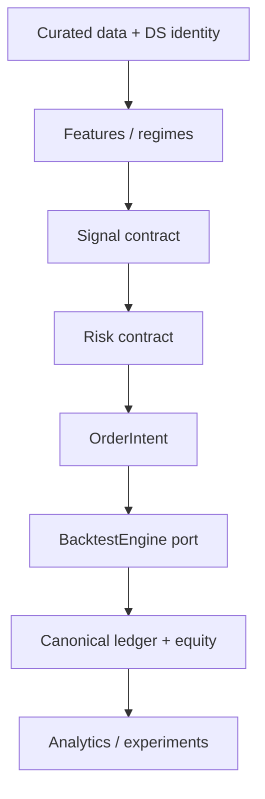

# Architecture

The accepted PHASE 0 design is defined in
[`PHASE_0_ARCHITECTURE_RESEARCH.md`](PHASE_0_ARCHITECTURE_RESEARCH.md). PHASE 3 added the first
framework-neutral backtesting boundary. PHASE 4 implements canonical analytics and experiment
evidence. PHASE 5 adds framework-neutral control signals and a separate signal-to-order compiler.

Data, the T1 backtest boundary, control signals, canonical analytics and experiment tracking are
implemented. Feature research, candidate strategies, the full risk engine and ML remain future
modules; the diagram describes dependency direction as well as the eventual system.

## Implemented packages

| Package | Responsibility |
|---|---|
| `data.contracts` | provider-independent candles, instruments and timeframes |
| `data.adapters` | official Bybit V5 public boundary |
| `data.validation` | deterministic integrity policy |
| `data.resampling` | complete-bucket aggregation and parity |
| `data.storage` / `manifest` | immutable lake, content identity and lineage |
| `data.pipeline` | raw → normalized → curated/quarantine orchestration |
| `backtesting.contracts` | orders, assumptions, funding/mark inputs and canonical outputs |
| `backtesting.engine` | conservative deterministic T1 reference kernel |
| `backtesting.artifacts` | immutable canonical JSON backtest evidence |
| `backtesting.scenarios` | synthetic non-strategy runtime proof |
| `analytics.contracts` / `metrics` | closed trades and versioned portfolio statistics |
| `experiments.contracts` / `store` | monotonic IDs, SQLite lifecycle and immutable evidence |
| `benchmarks.contracts` / `strategies` | owned targets and four frozen comparison controls |
| `benchmarks.compiler` | timing, sizing and full-fill gate from targets to order intents |
| `benchmarks.runner` / `scenarios` | shared execution, 100-seed distribution and offline proof |
| `serialization` | canonical JSON, hashing and atomic write-once support |

## Dependency rules

- Domain packages do not import exchange, storage or third-party engine types.
- Exchange and future engine adapters depend inward on owned contracts, never the reverse.
- A strategy will emit signals, not exchange orders and not backtester-specific objects.
- A future risk engine will produce approved order intents and sizing independently of execution.
- Analytics consumes the canonical result; it cannot reach into engine internals.
- The experiment registry indexes evidence but does not decide strategy promotion.
- ML may produce deterministic scores through a versioned model contract, never text-prompt
  BUY/SELL decisions.

## Backtest replacement seam

`BacktestEngine.run(BacktestRequest) -> BacktestResult` is the replacement seam. The current
reference implementation is a correctness oracle. A stable NautilusTrader adapter can replace it
for richer event simulation only after golden parity tests pass. T0 vectorized research and T2
microstructure replay will also emit the same canonical evidence where concepts overlap.

The detailed decision is in
[`PHASE_3_NAUTILUS_CAPABILITY_GATE.md`](PHASE_3_NAUTILUS_CAPABILITY_GATE.md); execution semantics are
in [`BACKTESTING.md`](BACKTESTING.md).

## Runtime topology

The default Compose service remains a network-disabled research heartbeat. The opt-in data service
alone reaches public Bybit endpoints. Backtest and experiment commands require no network and may
run in the research image. Market data and experiment artifacts remain on separate VPS volumes and
out of Git. No paper or live execution adapter exists.
