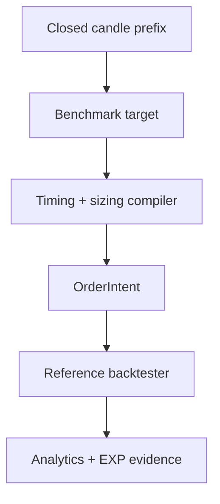

# Benchmark Controls

Status: PHASE 5 implemented. These controls define comparison floors; they are not candidate alpha
strategies and none is approved for paper or live trading.

## Frozen comparison policy

`benchmark-comparison-policy-v1` was fixed before inspecting historical market results:

1. one run contains one immutable `DS-*` dataset, symbol, timeframe and UTC window;
2. every benchmark uses the same fixed quantity, initial cash, leverage, fees, spread, slippage,
   bar-participation cap, latency, funding and mark inputs;
3. signals are target positions (`FLAT`, `LONG`, `SHORT`) timestamped at candle close;
4. a target can fill no earlier than the following bar open;
5. the compiler rejects signals outside known closes, duplicate/redundant targets, invalid quantity
   precision and any next bar whose participation capacity cannot guarantee a complete fill;
6. all controls finish flat so closed-trade comparisons do not hide terminal unrealized PnL;
7. parameters are fixed, not searched, and results receive `INCONCLUSIVE` unless a separate,
   predeclared research question supports another manual verdict;
8. every executed path can be registered as its own `EXP-*` bundle.

This phase does not define a promotion threshold for a future strategy family. Before PHASE 6,
each hypothesis must predeclare its primary metric, minimum activity, allowed benchmark comparison,
test window and rejection rule. Profit alone is never a pass condition.

## Implemented controls

| Control | Frozen rule | Purpose / boundary |
|---|---|---|
| Buy & Hold | long after first close; flat at the penultimate close | directional market baseline; on a perpetual it is not spot holding and must include supplied funding |
| Random Entry | entry probability `0.10`; equal deterministic long/short draw; hold `5` bars; seeds `0..99` | estimates outcomes attributable to entry timing under identical sizing and costs |
| Simple Trend Following | close breakout above/below the previous 50-bar high/low | deliberately simple price-only trend control; no parameter optimization |
| Simple Mean Reversion | 20-bar population z-score; enter at `±2`; exit on zero crossing | deliberately simple price-only reversion control; no parameter optimization |

Random Entry uses SHA-256-derived uniform values, so it is stable across Python versions and does
not depend on process-global random state. PHASE 5 reports 100 paths with min, p05, median, mean,
p95 and max net return. This distribution is an infrastructure benchmark, not the later minimum
10,000-run Monte Carlo robustness analysis.

## Signal and execution boundary



Strategies cannot set exchange order types, leverage, fees or fills. `FixedQuantityPolicy` is a
comparison fixture, not the PHASE 9 risk engine. A direction flip compiles to twice the fixed
quantity; a flat transition is reduce-only. Full-fill capacity is checked before execution so
partial fills cannot silently give one control a different exposure path.

## Bias and interpretation controls

- rolling calculations use only the current closed candle and earlier candles;
- breakout extrema exclude the current candle;
- tests compare past signals after appending future candles;
- administrative test-window liquidation is explicitly tagged and scheduled next-open;
- no random `train_test_split`, optimizer, feature selection or historical parameter tuning exists;
- a missing funding history is a declared zero-funding assumption, never evidence that funding is
  economically irrelevant;
- synthetic smoke results validate plumbing only and are always `INCONCLUSIVE`.

Run the complete offline proof (three deterministic paths plus 100 Random Entry paths):

```bash
uv run atl benchmark self-test --root artifacts/phase-5-smoke
```

The command records 103 experiment bundles and reports distribution statistics. Real Bybit
evidence requires a curated historical dataset and historical funding inputs; neither is fabricated
by this smoke test.

## Deferred work

- predefined real-data symbol/timeframe/date matrix and funding backfill;
- comparison by symbol, timeframe, subperiod and regime;
- portfolio-level equivalent-risk comparison;
- parameter-region perturbation, bootstrap, multiple-testing correction and walk-forward;
- minimum 10,000 Monte Carlo simulations;
- MAE/MFE and R multiples after point-in-time path/risk contracts exist.
