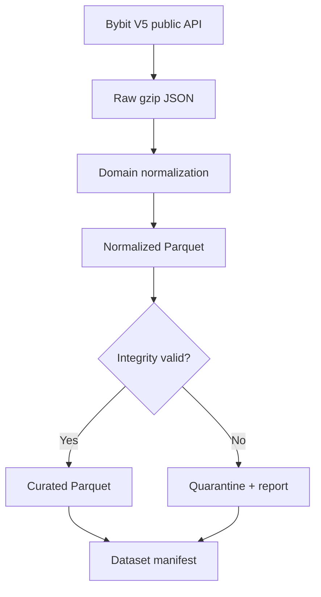

# Data Engine

## Status and scope

PHASE 2 implements a credential-free data engine for Bybit linear USDT perpetuals. It owns
instrument metadata and closed OHLCV candles. Funding, open interest, liquidations, mark/index
prices, trades and order books remain planned extensions; their future adapters must reuse the
same raw evidence, validation, manifest and storage boundary.

No private endpoint, API key or trading endpoint exists in this phase.

Official contracts verified on 2026-08-14:

- [Bybit V5 Get Kline](https://bybit-exchange.github.io/docs/v5/market/kline);
- [Bybit V5 Get Instruments Info](https://bybit-exchange.github.io/docs/v5/market/instrument);
- [Bybit V5 Get Server Time](https://bybit-exchange.github.io/docs/v5/market/time);
- [Bybit V5 rate limits](https://bybit-exchange.github.io/docs/v5/rate-limit).

The adapter does not use CCXT types. Domain contracts are independent of the provider so a
future exchange adapter can be replaced without changing validation, research or backtesting.

## Initial universe and intervals

The default metadata universe is:

`BTCUSDT ETHUSDT SOLUSDT XRPUSDT BNBUSDT DOGEUSDT ADAUSDT LINKUSDT AVAXUSDT BCHUSDT LTCUSDT`

Supported candle intervals are `1m`, `5m`, `15m`, `1h`, `4h` and `1d`. The recommended research
source is native `1m`, deterministically resampled to higher intervals. Native higher-timeframe
candles can be stored separately and compared with derived candles using parity checks.

## Flow and trust boundary



The production CLI injects the data lake as the adapter's raw-page sink, so every decoded provider
page is persisted before its envelope or rows are normalized. A failed dataset is never silently
repaired or promoted. The backtester and ML layers must read only `curated` datasets referenced by
a manifest.

## Data zones

| Zone | Format | Meaning | Mutable |
|---|---|---|---|
| `raw` | canonical gzip JSON | Provider response, request parameters and retrieval time | No |
| `normalized` | Parquet/Zstandard | Parsed domain rows before quality acceptance | No |
| `curated` | Parquet/Zstandard | Closed rows that passed blocking checks | No |
| `quarantine` | Parquet + JSON | Rejected rows and complete findings | No |
| `manifests` | JSON | Version, lineage, hashes, row count, window and validation summary | No |

Raw JSON is retained rather than converted immediately to Parquet because it is the forensic
source of truth when an upstream schema changes. Analytical data uses Parquet with Zstandard,
UTC millisecond timestamps and `decimal128(38,18)` values to avoid binary floating-point drift.

Parquet layout:

```text
data/{zone}/bybit/linear/ohlcv/
  timeframe=1m/symbol=BTCUSDT/year=2026/month=08/
    part-ds-....parquet
```

Market data is excluded from Git and belongs on a persistent VPS volume.

## Provider behavior handled explicitly

- Klines are returned newest first; the adapter sorts them chronologically.
- The last open candle contains a changing close; server time is fetched and only candles whose
  exclusive close time is not later than server time survive normalization.
- Kline history is paginated backward with an exclusive internal end boundary.
- Provider duplicates are preserved through normalization so the validator can report them; they
  are never silently overwritten by timestamp.
- Linear instrument metadata exceeds the default page size; cursor pagination continues until the
  cursor is empty and repeated cursors fail closed.
- Requested instruments must all be present as trading `LinearPerpetual` contracts settled in
  USDT, otherwise ingestion fails rather than returning a partial universe.
- API envelopes, categories, symbols and numeric fields are checked before normalization.

## Validation policy

Every normalized OHLCV batch is checked for:

- empty datasets;
- homogeneous symbol and timeframe;
- timezone-aware UTC timestamps;
- exact timeframe alignment;
- duplicates and non-monotonic ordering;
- missing candles and timestamp continuity;
- incomplete candles relative to Bybit server time;
- positive prices and valid OHLC containment;
- negative volume or turnover;
- zero volume (warning by default, configurable as an error);
- anomalous close-to-close returns (warning at an explicit threshold).

Warnings remain visible in the manifest. Errors route the entire batch to quarantine. This avoids
creating a curated series whose continuity differs from its manifest.

## Dataset identity and lineage

Each batch receives a content-derived ID such as `DS-7A40...`. The hash includes canonical candle
values, symbol, timeframe, requested window, transformation version and validation policy.
Manifests record:

- dataset type and version;
- provider and market category;
- symbol, timeframe and UTC range;
- generation timestamp and curation status;
- transformation and parent versions;
- every artifact path, SHA-256 and row count;
- total rows, errors and warnings.

Writing the same dataset twice does not rewrite curated partitions or its original manifest.
Temporary files are flushed and atomically renamed, so interrupted writes do not become datasets.

## Deterministic resampling

`resample_candles` accepts one homogeneous series and a target interval that is an exact larger
multiple. It emits only complete, aligned buckets. A partial or gapped bucket is omitted; the
source validator must still report the underlying gap. OHLC uses first/max/min/last and volume plus
turnover are summed with exact decimals.

`compare_candle_parity` reports field-level differences between derived and Bybit-native candles
under an explicit tolerance. Parity results will become a formal dataset gate when the initial
historical backfill policy is selected.

## Commands

Local metadata snapshot using the initial universe:

```bash
ATL_DATA_ROOT=data uv run atl data instruments
```

Closed candle window; start is inclusive and end is exclusive:

```bash
ATL_DATA_ROOT=data uv run atl data candles \
  --symbol BTCUSDT \
  --timeframe 1m \
  --start 2026-08-01T00:00:00Z \
  --end 2026-08-02T00:00:00Z
```

Docker uses the persistent `market-data` volume:

```bash
docker compose --profile data run --rm data \
  python -m ai_trading_lab data instruments
```

These commands access public market endpoints only. They cannot submit orders.

## Deferred decisions

- Raw-response retention and disk budget on the VPS.
- Earliest historical date per instrument.
- Whether canonical higher timeframes are only derived from 1m or also retained natively.
- Scheduled incremental ingestion and late-data reconciliation.
- Funding, open-interest, mark/index, trades and order-book schemas.
