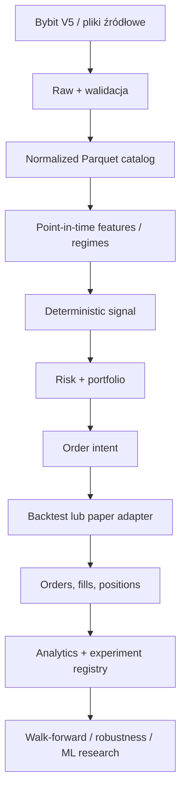

# PHASE 0 — Architecture Research

**Projekt:** `ai-trading-lab` (nazwa rekomendowana do pozostawienia)
**Status dokumentu:** decyzja architektoniczna PHASE 0
**Stan źródeł:** 2026-08-14
**Zakres:** wyłącznie research technologiczny i projekt docelowej architektury; bez strategii, kluczy API, połączeń z giełdą i implementacji.

## 1. Decyzja wykonawcza

Rekomendowana jest **własna, modularna platforma badawcza w Pythonie, oparta na jawnych kontraktach domenowych, z NautilusTrader jako pierwszym kandydatem na event-driven backtest i późniejszy paper execution**. Kod strategii, feature engineeringu, walidacji, ryzyka, portfela, eksperymentów i analityki pozostaje własnością projektu i nie może zależeć od klas jednego frameworka.

Technologie pełnią różne role:

- **NautilusTrader** — kandydat na dokładny kernel zdarzeniowy oraz późniejszy adapter Bybit; jego dopuszczenie wymaga testów zgodności i pinowania wersji, ponieważ w sierpniu 2026 projekt przechodzi z v1/Cython do v2 Rust/PyO3.
- **VectorBT (OSS; Pro opcjonalnie)** — szybki skaner hipotez i przestrzeni parametrów, ale nie arbiter końcowego wyniku.
- **oficjalne Bybit V5 API** — źródło prawdy dla semantyki rynku i podstawowy interfejs pozyskiwania danych; CCXT/CCXT Pro może być adapterem pomocniczym, nie źródłem modelu domenowego.
- **Parquet + DuckDB** — warstwa danych na VPS; PostgreSQL — rejestr eksperymentów i metadanych; MLflow dopiero w fazie ML.
- **Freqtrade** — wartościowy punkt odniesienia i ewentualny adapter eksperymentalny, ale nie fundament platformy.
- **Backtrader** — odrzucony jako główny silnik.
- **własny pełny silnik** — plan awaryjny, nie punkt startowy.

Najważniejsza zasada: szybki wynik z narzędzia wektorowego nie może zostać uznany za przewagę. Promocja hipotezy wymaga event-driven backtestu, kosztów, walidacji czasowej, benchmarków, stabilności parametrów i out-of-sample.

## 2. Kryteria i metoda oceny

Ocena dotyczy Bybit USDT Linear Perpetual, short, leverage, funding, opłat, spreadu/slippage, multi-timeframe, danych tick/order book, integracji ML, walk-forward, paper/live, działania 24/7, wydajności, utrzymania i odtwarzalności.

Skala w tabelach:

- **5** — bardzo dobre/natywne,
- **4** — dobre, z niewielkimi uzupełnieniami,
- **3** — użyteczne, ale wymaga istotnego kodu własnego,
- **2** — ograniczone lub niedopasowane,
- **1** — praktycznie brak,
- **?** — konieczny test dowodowy przed podjęciem zależności.

Ocena oddziela deklarowane możliwości od realizmu modelu. Sam parametr `fee` lub `slippage` nie oznacza poprawnej symulacji kolejki, częściowych filli, płynności, mark price ani likwidacji.

## 3. Stan narzędzi w 2026 roku

### 3.1 Porównanie frameworków backtest/live

| Kryterium | Freqtrade | NautilusTrader | VectorBT OSS / Pro | Backtrader | Własny silnik Python |
|---|---:|---:|---:|---:|---:|
| Backtesting świecowy | 4 | 4 | 5 | 3 | zależne od implementacji |
| Event-driven / zgodność backtest-live | 3 | 5 | 2 / 3 | 3 | potencjalnie 5 |
| Bybit USDT perpetual | 4 | 5 | 2 / 3 | 1 | potencjalnie 5 |
| Short i leverage | 4 | 5 | 4 | 2 | potencjalnie 5 |
| Funding | 3 | 4? | 2 / 3 | 1 | potencjalnie 5 |
| Fees | 4 | 5 | 4 | 4 | potencjalnie 5 |
| Spread/slippage | 2–3 | 5 | 3–4 | 3 | potencjalnie 5 |
| Liquidation / margin realism | 3 | 4? | 2 | 2 | potencjalnie 5 |
| Multi-timeframe | 4 | 5 | 5 | 4 | potencjalnie 5 |
| Tick / trades / order book | 2–3 | 5 | 2 / 4 | 2 | potencjalnie 5 |
| Portfolio / wiele instrumentów | 3 | 5 | 5 | 3 | potencjalnie 5 |
| Szybkie grid scans | 4 | 3–4 | 5 | 2 | 1–5 |
| ML integration | 4 (FreqAI) | 4 (Python, własna warstwa) | 5 | 3 | 5 |
| Walk-forward natywnie | 2–3 | 3 | 4 (Pro lepiej) | 2 | potencjalnie 5 |
| Paper/live | 5 | 5 | 2–3 | 2 | potencjalnie 5 |
| VPS / Docker | 5 | 4 | 4 | 3 | potencjalnie 5 |
| Maintenance 2026 | 5 | 5, ale migracja v2 | 3 / 4 | 1–2 | koszt własny |
| Reproducibility | 3–4 | 4 | 3–4 | 3 | potencjalnie 5 |

#### Freqtrade

Mocne strony:

- aktywnie utrzymywany, gotowy Docker, dry-run, web UI, backtest, hyperopt, ochrona kapitału i operacyjnie prosty VPS;
- futures, short i isolated futures na Bybit są wspierane;
- ma dedykowane `lookahead-analysis` i `recursive-analysis`;
- pozwala na dokładniejszy timeframe pomocniczy i uwzględnia fees.

Ograniczenia dla tego projektu:

- architektura jest bot-first i candle/dataframe-first, a projekt ma być research-first oraz później obejmować tick/orderbook i własny portfolio/risk engine;
- strategia, sposób fillowania i lifecycle bota są mocno związane z frameworkiem;
- domyślny backtest opiera się na założeniach intrabar, a nie na odtworzeniu rynku; `timeframe-detail` poprawia rozdzielczość, lecz nie tworzy pełnego modelu mikrostruktury;
- nie daje kompletnego, automatycznego walk-forward z purging/embargo i sklejaniem wyłącznie OOS bez kodu własnego;
- Bybit w Freqtrade jest ograniczony do isolated futures i one-way mode. Dokumentacja Freqtrade podaje też, że dla Bybit używa obliczenia zastępczego funding w dry/live, mimo że oficjalne Bybit V5 udostępnia endpoint historii funding. Jest to ważna rozbieżność adaptera, którą trzeba traktować jako ryzyko modelu, nie jako brak danych na giełdzie;
- cross-position influence nie musi być w pełni symulowany w dry-run/backtest.

Wniosek: **nie wybierać jako rdzenia**. Freqtrade może później służyć jako niezależny benchmark operacyjny albo awaryjny paper-runner dla prostych strategii świecowych.

Źródła: [Freqtrade — backtesting](https://docs.freqtrade.io/en/stable/backtesting/), [short/leverage](https://docs.freqtrade.io/en/stable/leverage/), [Bybit notes](https://docs.freqtrade.io/en/stable/exchanges/), [lookahead analysis](https://docs.freqtrade.io/en/stable/lookahead-analysis/), [releases](https://github.com/freqtrade/freqtrade/releases).

#### NautilusTrader

Mocne strony:

- event-driven, ports-and-adapters, wspólne komponenty strategii/portfela/ryzyka/execution w backtest i live;
- wydajny rdzeń Rust z Pythonem przez PyO3;
- natywny adapter Bybit z danymi i execution dla linear perpetual, order types, position/leverage/margin, demo i testnet;
- dane bar, quote, trade i L1/L2/L3; częściowe fille, chodzenie po poziomach książki, price protection, liquidity consumption, model filli i deterministyczne seedy;
- katalog Parquet i precyzyjne instrument definitions;
- dobry model domenowy: instrument, order, fill, position, account, portfolio.

Ograniczenia i ryzyka:

- projekt jest w fazie przejścia. Release 1.231.0 z 2026-08-02 opisuje v2 Rust/PyO3 jako release candidate i zapowiada przejście `develop` na v2-only;
- nie jest platformą research/ML, eksperyment tracking ani gotowym walk-forward — te warstwy muszą być nasze;
- jeden `BacktestNode`/`TradingNode` na proces, więc równoległość eksperymentów musi być procesowa;
- dokładność zależy od jakości wejścia: backtest na OHLC nadal nie zna prawdziwej kolejności intrabar;
- fill model nie zastępuje historycznej kolejki. Nawet przy order book symulowane fille nie zmieniają historycznej książki bez jawnego `liquidity_consumption`;
- poprawność funding, margin i przymusowej likwidacji dla linear perpetual w wybranej wersji musi przejść testy kontraktowe. Nie należy przyjmować jej z samego opisu funkcji.

Wniosek: **najlepszy kandydat na kernel event-driven**, ale za portem `BacktestEngine`/`ExecutionVenue`, z przypiętą wersją i testami parity. W PHASE 3 należy przeprowadzić spike v2 i dopiero wtedy zatwierdzić wersję.

Źródła: [architektura](https://nautilustrader.io/docs/latest/concepts/architecture/), [backtesting](https://nautilustrader.io/docs/latest/concepts/backtesting/), [fill models](https://nautilustrader.io/docs/latest/concepts/backtesting/fill-models/), [fill prices and matching](https://nautilustrader.io/docs/latest/concepts/backtesting/fill-prices-and-matching), [katalog danych](https://nautilustrader.io/docs/latest/concepts/data/), [Bybit adapter](https://nautilustrader.io/docs/latest/integrations/bybit/), [releases](https://github.com/nautechsystems/nautilus_trader/releases).

#### VectorBT / VectorBT Pro

Mocne strony:

- bardzo szybka analiza macierzy sygnałów i szerokich przestrzeni parametrów;
- portfolio, long/short, fees, slippage, stop rules, statystyki i ekosystem NumPy/Pandas/Numba;
- wygodne badanie stabilnych regionów oraz wielu symboli;
- Pro dodaje rozbudowane mechanizmy chunking, konfiguracji, optymalizacji i więcej możliwości event-driven.

Ograniczenia:

- model wektorowy z natury upraszcza sequencing, kolejkę zleceń, opóźnienia i stan giełdy;
- „event-driven callbacks” nie są równoznaczne z venue-accurate execution;
- funding, margin tiers, mark-price liquidation i mikrostruktura wymagają własnych rozszerzeń;
- OSS i Pro mają różne możliwości, a Pro jest prywatnym, płatnym repozytorium do użytku osobistego lub na osobnej licencji organizacyjnej;
- nie powinien być jedynym źródłem wyniku kwalifikującego strategię do paper.

Wniosek: **opcjonalny accelerator**. Używać do przesiewania hipotez; wszystko, co przechodzi dalej, powtórzyć w dokładnym silniku.

Źródła: [VectorBT features](https://vectorbt.dev/getting-started/features/), [portfolio API](https://vectorbt.dev/api/portfolio/base/), [VectorBT Pro](https://vectorbt.pro/), [licencja/członkostwo Pro](https://vectorbt.pro/become-a-member/).

#### Backtrader

Mocne strony: prosty event loop, resampling, commission schemes, futures-like margin, podstawowy slippage, duża liczba przykładów.

Ograniczenia: brak natywnego, współczesnego modelu Bybit perpetual, funding, mark/index, likwidacji i order book; stary model live adapterów; repozytorium główne wykazywało ostatni commit sprzed około trzech lat. Rozbudowa do wymagań projektu byłaby w praktyce pisaniem własnego silnika na starym fundamencie.

Wniosek: **odrzucony jako główny kandydat**.

Źródła: [repozytorium](https://github.com/mementum/backtrader), [slippage](https://www.backtrader.com/docu/slippage/slippage/), [commission schemes](https://www.backtrader.com/docu/commission-schemes/commission-schemes/).

#### Własny silnik Python

Mocne strony: pełna kontrola nad kontraktami, funding, liquidation, kolejnością zdarzeń, audit trail i metodologią.

Wady: największe ryzyko ukrytych błędów, duży koszt testów, utrzymania adapterów, reconciliacji, precision, margin tiers i edge cases. Przed badaniem przewagi zespół mógłby przez wiele miesięcy badać własne błędy silnika.

Wniosek: nie budować całości na starcie. **Budować własne kontrakty i warstwy; własny kernel tylko jeśli Nautilus nie przejdzie capability gate.**

### 3.2 Connectivity: CCXT/CCXT Pro vs oficjalne Bybit V5

| Obszar | CCXT / CCXT Pro | Oficjalne Bybit V5 |
|---|---|---|
| Cel | ujednolicenie wielu giełd | pełna semantyka jednej giełdy |
| REST | szerokie, zunifikowane API + raw endpoints | kompletne źródło prawdy |
| WebSocket | CCXT Pro, async, ujednolicone watch methods | public/private/trade streams, venue-specific sequence |
| Bybit market metadata | wygodne, ale abstrahowane | pełne precision, limits, risk/funding interval |
| Funding/OI/mark/index | część zunifikowana, część exchange-specific | natywne endpointy historyczne |
| Order book | zunifikowany | snapshot/delta, `u`, `seq`, matching-engine timestamp `cts` |
| Execution | szybciej uruchamialne multi-exchange | najlepsza kontrola idempotency i cech Bybit |
| Ryzyko | zmiana mapowania lub lowest-common-denominator | większy vendor coupling i więcej kodu |

Decyzja:

1. **Dane Bybit:** oficjalne HTTP/WebSocket V5 przez cienki własny adapter. Archiwizować również raw payload i informacje o endpoint/version.
2. **Instrument metadata:** oficjalny `instruments-info`; paginacja obowiązkowa, bo Bybit ma ponad 500 instrumentów linear.
3. **Paper execution:** preferowany adapter Nautilus Bybit po testach; bezpośredni V5 jako referencja w testach kontraktowych.
4. **CCXT/Pro:** opcjonalny fallback lub przyszły adapter multi-exchange. Nigdy nie przepuszczać obiektów CCXT do domeny; mapować do własnych typów.

Bybit V5 udostępnia historyczne klines, mark/index klines, funding i open interest; real-time trades, order book oraz liquidation stream. Historyczne likwidacje i pełna historia order book nie są równoważnie dostępne z prostego REST, więc dane mikrostrukturalne trzeba zacząć kolekcjonować samemu lub później kupić od dostawcy. Oficjalny stream kline ma flagę `confirm`; tylko `confirm=true` może trafić do closed-candle dataset.

Źródła: [Bybit V5 Kline](https://bybit-exchange.github.io/docs/v5/market/kline), [funding history](https://bybit-exchange.github.io/docs/v5/market/history-fund-rate), [open interest](https://bybit-exchange.github.io/docs/v5/market/open-interest), [mark price kline](https://bybit-exchange.github.io/docs/v5/market/mark-kline), [order book](https://bybit-exchange.github.io/docs/v5/websocket/public/orderbook), [public trades](https://bybit-exchange.github.io/docs/v5/websocket/public/trade), [liquidations](https://bybit-exchange.github.io/docs/v5/websocket/public/all-liquidation), [rate limits](https://bybit-exchange.github.io/docs/v5/rate-limit), [CCXT manual](https://github.com/ccxt/ccxt/wiki/manual), [CCXT Pro](https://github.com/ccxt/ccxt/wiki/ccxt.pro.manual).

### 3.3 Frameworki ML i eksperymentów

| Narzędzie | Rola | Decyzja |
|---|---|---|
| scikit-learn | Pipeline, preprocessing, Logistic Regression, RF/Extra Trees, calibration, Brier, permutation importance | fundament baseline ML |
| LightGBM | szybki gradient boosting na tabular features | kandydat po baseline liniowym |
| XGBoost | dojrzały boosting, dobra diagnostyka | kandydat równoległy |
| CatBoost | boosting, stabilne defaults, kategorie jeśli pojawią się | kandydat, nie automatyczny zwycięzca |
| SHAP | diagnostyka modeli drzewiastych | tylko dla finalistów, razem z permutation importance |
| Optuna | kontrolowane strojenie | dopiero wewnątrz TRAIN/VALIDATION; nigdy na TEST |
| MLflow | lineage, parametry, metryki, artefakty i registry modeli | uruchomić w PHASE 11, nie jako rejestr wszystkich backtestów od dnia 1 |
| PyTorch | przyszłe sekwencje/deep learning | odroczone do momentu pokonania tabular baselines |
| sktime / forecasting frameworks | modele forecast i walidacja szeregów | opcjonalne; nie są wymagane dla setup scoring |

`TimeSeriesSplit` jest lepszy niż random split, ale nie rozwiązuje automatycznie overlapping labels. Projekt potrzebuje własnego `PurgedWalkForwardSplit` z embargo, jawnie testowanego na indeksach zdarzeń. Scikit-learn ostrzega, że klasyczne KFold/ShuffleSplit dają nierzetelne estymaty dla autokorelacyjnych szeregów czasowych i wskazuje `TimeSeriesSplit` jako właściwy punkt wyjścia.

Źródła: [scikit-learn time-series CV](https://scikit-learn.org/stable/modules/cross_validation.html#time-series-split), [Pipeline](https://scikit-learn.org/stable/modules/generated/sklearn.pipeline.Pipeline.html), [permutation importance](https://scikit-learn.org/stable/modules/generated/sklearn.inspection.permutation_importance.html), [MLflow tracking](https://mlflow.org/docs/latest/ml/tracking/), [MLflow model registry](https://mlflow.org/docs/latest/ml/model-registry/).

## 4. Rozważane architektury

### Opcja A — Freqtrade-first

Freqtrade obsługuje dane, strategie, backtest, hyperopt i paper/live; własne moduły raportowe i ML otaczają bota.

**Zalety:** najszybszy paper bot, prosty Docker/VPS, wiele gotowych funkcji operacyjnych.
**Wady:** silny lock-in strategii i danych, świecowy model wykonania, trudniejsza niezależność risk/portfolio/execution, słabsza ścieżka do tick/orderbook i pełnego walk-forward.
**Ocena:** dobra architektura dla „uruchom bota”, słaba dla „zbadaj, czy istnieje przewaga”. Odrzucona.

### Opcja B — modular research platform + Nautilus kernel (rekomendowana)

Własne warstwy DATA/FEATURES/SIGNAL/VALIDATION/RISK/PORTFOLIO/ANALYTICS/ML. Nautilus jest adapterem backtest/execution za własnymi protokołami. VectorBT może przyspieszać research, ale nie zmienia kontraktów.

**Zalety:** realizm, wspólna semantyka backtest-paper, natywny Bybit, brak lock-in domeny, możliwość późniejszego order book.
**Wady:** większy koszt startowy niż Freqtrade; trzeba zaprojektować experiment tracking i walk-forward; ryzyko migracji Nautilus v2.
**Ocena:** najlepszy bilans profesjonalnego researchu, późniejszego execution i kosztu budowy.

### Opcja C — full custom + VectorBT scanner + CCXT/Bybit

Cała domena i event engine są własne; VectorBT służy do scans; Bybit V5/CCXT do danych i execution.

**Zalety:** pełna kontrola, idealne dopasowanie, najmniejszy framework lock-in.
**Wady:** największy koszt, ogromna powierzchnia testów, ryzyko błędów w fill/margin/reconciliation większe od ryzyka strategii.
**Ocena:** plan B, jeżeli Nautilus nie przejdzie testów capability/parity; nie zaczynać od tego.

## 5. Architektura rekomendowana

### 5.1 Zasady

1. **Hexagonal boundaries:** frameworki i giełda są adapterami; domena ich nie importuje.
2. **Deterministic core:** strategia generuje `Signal`, risk generuje lub odrzuca `OrderIntent`, execution generuje `OrderEvent`/`Fill`.
3. **Point-in-time correctness:** każdy rekord ma `event_time` i `available_time`; decyzja może widzieć tylko `available_time <= decision_time`.
4. **Jedna semantyka kosztów:** fees, funding, spread, slippage, latency i fill model są wersjonowanym `ExecutionAssumptionSet`.
5. **Tiered fidelity:** tanie skany -> event-driven bars -> tick/orderbook dla finalistów.
6. **Research and production parity:** te same kontrakty signal/risk/order w backtest i paper.
7. **Fail closed:** brak świeżych/poprawnych danych blokuje sygnał; LIVE nie istnieje operacyjnie do PHASE 15.
8. **Immutable evidence:** wyniki eksperymentów i datasety są append-only; raport można odtworzyć z manifestu.

### 5.2 Warstwy i zależności



Dozwolony kierunek zależności:

- domena zna tylko własne typy i protokoły;
- `features` może zależeć od `data contracts`, ale nie od backtestera;
- `strategy` nie zna giełdy, salda ani API;
- `risk` zna signal i portfolio snapshot, ale nie Bybit payload;
- adapter wykonawczy mapuje `OrderIntent` na Nautilus/Bybit;
- analytics konsumuje zdarzenia, nie wywołuje strategii;
- ML tworzy wersjonowany `ModelSignalComponent`, ale nie omija risk engine.

### 5.3 Kontrakty domenowe

Minimalne stabilne obiekty:

- `Instrument`: venue, symbol, contract type, base/quote/settle, tick/step, min/max qty/notional, leverage/risk tier, valid_from/to;
- `Bar`: open/close time, OHLCV, timeframe, source, `is_closed`, event/available time;
- `Trade`, `Quote`, `OrderBookDelta`, `FundingRate`, `OpenInterest`, `MarkPrice`, `IndexPrice`, `Liquidation`;
- `FeatureFrame`: values + feature-set version + as-of timestamp + warm-up metadata;
- `Signal`: strategy id/version, side, strength/score, horizon, invalidation, decision time, evidence refs;
- `PortfolioSnapshot`: cash, equity, margin, positions, exposure, concentration, correlations;
- `RiskDecision`: approve/reject/reduce, reason codes, requested/approved risk and size;
- `OrderIntent`: venue-neutral side/type/qty/limit/trigger/TIF/reduce-only/client id;
- `OrderEvent` i `Fill`: exchange id, client id, timestamps, price, qty, liquidity, fee;
- `ExperimentManifest`: pełna konfiguracja odtwarzalności.

Wszystkie wartości pieniężne i ilości na granicy execution używają `Decimal` lub fixed-point; `float64` może być używany w macierzach research, ale przed zleceniem musi przejść przez instrument precision.

## 6. Projekt warstwy danych

### 6.1 Zakres startowy

Universe startowy:

`BTCUSDT ETHUSDT SOLUSDT XRPUSDT BNBUSDT DOGEUSDT ADAUSDT LINKUSDT AVAXUSDT BCHUSDT LTCUSDT`

Timeframes: `1m 5m 15m 1h 4h 1d`.

Źródłem kanonicznym świec jest **1m**; wyższe timeframe są deterministycznie budowane z 1m tam, gdzie kompletność jest potwierdzona. Równolegle można przechowywać natywne Bybit 5m–1d jako materiał kontrolny i wykonywać parity checks. Nie wolno tworzyć pełnej świecy wyższego timeframe z niepełnych 1m.

Kolejność rozszerzania:

1. bars + instrument metadata + mark/index + funding;
2. open interest;
3. public trades i top-of-book;
4. liquidations stream;
5. pełne L2 order book, jeśli konkretna hipoteza to uzasadni.

### 6.2 Strefy danych

- **raw** — niezmienione odpowiedzi API/WebSocket, kompresowane i append-only; dowód źródłowy;
- **normalized** — typowane, UTC, deduplikowane rekordy o stabilnym schemacie;
- **curated** — kompletne serie gotowe do badań, resampling, point-in-time joins;
- **features** — wersjonowane macierze cech, nigdy ręcznie edytowane;
- **quarantine** — rekordy/dni odrzucone przez walidator wraz z reason code.

Parquet jest formatem kanonicznym: kompresja ZSTD, columnar scans, schema metadata i zgodność z DuckDB/PyArrow/Nautilus. Partycjonowanie:

`venue=bybit/market=linear/type=<data_type>/symbol=<symbol>/year=YYYY/month=MM[/day=DD]`

Dla bars/funding/OI wystarczy miesiąc; dla trades/order book dzień lub godzina, zależnie od rozmiaru. Compactor scala tiny files. DuckDB jest lokalnym silnikiem zapytań, nie miejscem źródłowym. Dane, modele i wyniki masowe pozostają na wolumenach VPS, nie w Git.

### 6.3 Integralność

Każdy ingest kończy się raportem walidacji:

- schema/type/nullability;
- monotonic UTC timestamps i jawna jednostka czasu;
- unikalny klucz (`venue, symbol, timeframe, open_time` dla bars);
- continuity względem oczekiwanego kalendarza 24/7;
- missing i duplicate candles;
- OHLC invariants: `low <= open/close <= high`, ceny dodatnie;
- volume/turnover nieujemne; zero volume jest flagą, nie automatycznym błędem;
- anomalie: log-return/range/volume względem robust rolling median/MAD, jako flagi do przeglądu, nie automatyczne „naprawianie”;
- incomplete candle: REST close ostatniej świecy i WS `confirm=false` nie wchodzą do curated;
- instrument precision i valid listing interval;
- cross-source parity (natywna świeca Bybit vs resampling 1m);
- freshness SLA i gap backlog.

Gap nie jest wypełniany sztuczną świecą bez jawnego `imputation_method`; do backtestów tradingowych domyślnie powoduje przerwę lub odrzucenie zakresu. Ingest jest idempotentny. Korekta danych tworzy nową wersję, nie nadpisuje historycznej bez śladu.

### 6.4 Dataset versioning

`dataset_version` jest hashem kanonicznego manifestu obejmującego:

- source/endpoint i data type;
- symbol/timeframe/date range;
- schema version;
- instrument snapshot version;
- lista plików, row count, min/max event time i SHA-256;
- kod transformacji (`git_commit`);
- validator version i wyniki;
- parent dataset version;
- created_at UTC.

To zapewnia odtwarzalność bez commitowania danych do Git. Survivorship bias ogranicza się przez wersjonowane snapshoty instrumentów, daty listing/delisting i universe ustalany **as-of**, nie na podstawie dzisiejszej listy.

## 7. Projekt backtestingu

### 7.1 Trzy poziomy wierności

| Poziom | Dane | Cel | Czy może kwalifikować do paper? |
|---|---|---|---|
| T0 — vector scan | bar close/arrays | szybkie falsyfikowanie hipotez, regiony parametrów | nie |
| T1 — event bars | 1m + mark/funding, wyższe TF jako sygnał | portfolio, risk, stop/TP, konserwatywne fille | warunkowo po testach |
| T2 — quote/trade/order book replay | tick/L1/L2 | finalna walidacja execution-sensitive strategii | tak |

Silniki muszą produkować ten sam kanoniczny ledger orders/fills/positions. Dla wybranych prostych scenariuszy wyniki T0 i T1 są porównywane. Różnice ponad tolerancję muszą być wyjaśnione, a nie uśrednione.

### 7.2 Model wykonania T1

- sygnał z zamknięcia baru `t` najwcześniej składa zlecenie po jego `available_time`; brak fill po tym samym close;
- market order: następny dostępny bid/ask, plus jawny spread i adverse slippage;
- limit: brak fill tylko dlatego, że `low <= limit <= high`; wymagany jawny, konserwatywny model touch/cross oraz prawdopodobieństwo/udział wolumenu;
- gdy stop i take-profit są dotknięte w tej samej świecy, wynik domyślnie przyjmuje wariant niekorzystny albo używa 1m/tick do rozstrzygnięcia;
- partial fills, rejection, precision/min notional i max participation rate;
- maker/taker fee według typu faktycznego filla;
- funding naliczany w settlement timestamps od pozycji i historycznej stawki, z testami znaku long/short;
- mark price do unrealized PnL i liquidation checks; trade price do filli;
- liquidation: maintenance margin/risk tier + bufor bezpieczeństwa + liquidation fee. Do czasu zatwierdzenia dokładnego modelu raport ma oznaczenie `liquidation_model=approximate` i taki eksperyment nie może wejść do paper przy leverage > 1;
- latency model jawny i wersjonowany; w bars nie udaje precyzji milisekundowej.

### 7.3 Walk-forward

Domyślny szablon startowy:

`TRAIN 12 miesięcy -> VALIDATION 3 miesiące -> TEST 3 miesiące`, krok 3 miesiące.

To konfiguracja, nie dogmat. Minimalna liczba transakcji i reprezentacja regimes mogą wymusić dłuższe okna. Dla każdego folda:

1. fit cech wymagających estymacji tylko na TRAIN;
2. wybór rodziny/regionu parametrów na TRAIN;
3. decyzje i ewentualne strojenie wyłącznie na VALIDATION;
4. zamrożenie konfiguracji;
5. jednokrotne uruchomienie TEST;
6. zapis wszystkich kandydatów, nie tylko zwycięzcy;
7. sklejenie finalnej krzywej tylko z chronologicznych TEST.

Globalny końcowy holdout pozostaje zamknięty do momentu wyboru metodologii. Po obejrzeniu TEST nie wraca on do strojenia; kolejna iteracja staje się nową rodziną eksperymentów i zwiększa licznik multiple testing.

### 7.4 Lookahead i leakage controls

- point-in-time API wymaga `available_time`;
- feature functions dostają wycinek zakończony na decision time, nie cały DataFrame bez kontroli;
- rolling features są porównywane w batch vs incremental mode;
- resampling ma `label/closed` zdefiniowane kontraktem i test graniczny;
- automated prefix test: wynik dla prefiksu nie może zmienić się po dopisaniu przyszłych danych;
- target/label znajduje się w osobnej warstwie i nie może wejść do feature registry;
- normalizacja, imputacja i selekcja fit tylko w TRAIN;
- purging usuwa train samples, których label horizon zachodzi na validation/test; embargo tworzy dodatkowy gap;
- dynamic universe odtwarzany as-of;
- randomized timestamps/labels i intentional-leak fixtures muszą spowodować alarm;
- notebook nie jest źródłem produkcyjnej funkcji; zaakceptowany kod trafia do `src` i testów.

### 7.5 Benchmarki i metryki

Pierwsze strategie w PHASE 5 są benchmarkami, nie poszukiwaniem „magicznych wskaźników”:

- Buy & Hold (dla perpetual dodatkowo jasno opisany funding i brak analogii 1:1 do spot hold);
- Random Entry — wiele seedów, ta sama częstotliwość, holding period i risk engine co kandydat;
- Simple Trend Following;
- Simple Mean Reversion.

Raport obowiązkowy: trades, net return, CAGR, win rate, average win/loss, expectancy, profit factor, Sharpe, Sortino, Calmar, max drawdown, Ulcer Index, average/median R, longest losing streak, exposure, turnover, fees, funding, MAE/MFE oraz podział long/short, symbol, timeframe i regime. Metryki muszą mieć zdefiniowaną częstotliwość annualizacji i traktowanie cash/unrealized PnL.

### 7.6 Robustness, Monte Carlo i multiple testing

Kandydat przechodzi dalej tylko po:

- surface/heatmap parametrów i ocenie stabilnego regionu, nie pojedynczego maksimum;
- perturbacji fees/slippage/spread/latency;
- subperiod/symbol/regime analysis;
- block bootstrap lub stationary bootstrap zachowującym strukturę czasową;
- minimum 10 000 Monte Carlo dla kolejności transakcji/bootstrapped blocks, z rozkładem return, drawdown, losing streak i risk of ruin;
- porównaniu do dystrybucji Random Entry przy tym samym risk budget.

Rejestr prób (`trial_registry`) zapisuje również wyniki odrzucone. Roadmapa korekt:

1. od PHASE 5: liczba prób, holdout discipline, bootstrap confidence intervals i baseline random;
2. PHASE 7: Deflated Sharpe Ratio i PBO/CSCV;
3. później, dla dużych rodzin: White's Reality Check lub Hansen SPA z block bootstrap;
4. status wyniku: `REJECTED`, `INCONCLUSIVE`, `CANDIDATE`, nigdy ręczne „uratowanie” wyniku.

Źródła metod: [Probability of Backtest Overfitting](https://papers.ssrn.com/sol3/papers.cfm?abstract_id=2326253), [Deflated Sharpe Ratio](https://papers.ssrn.com/sol3/papers.cfm?abstract_id=2460551), [White's Reality Check](https://onlinelibrary.wiley.com/doi/abs/10.1111/1468-0262.00152), [Hansen SPA](https://www.tandfonline.com/doi/abs/10.1198/073500105000000063).

## 8. Experiment tracking i reproducibility

Każdy uruchomiony eksperyment otrzymuje ID z transakcyjnej sekwencji PostgreSQL:

`EXP-000001`, `EXP-000002`, ...

ID jest nadawane przed startem; eksperyment przerwany pozostaje w rejestrze jako `FAILED`/`CANCELLED`, nie zwalnia numeru.

Obowiązkowy manifest:

```yaml
experiment_id: EXP-000001
status: COMPLETED
git_commit: <sha>
dirty_worktree: false
dataset_version: <content-hash>
date_range: {start: <UTC>, end: <UTC>}
symbols: [...]
timeframes: [...]
strategy: {family: <name>, version: <semver-or-hash>}
feature_set_version: <hash>
parameters: {...}
risk_config_version: <hash>
execution_assumptions:
  fees: {...}
  spread: {...}
  slippage: {...}
  funding: {...}
  latency: {...}
engine: {name: <name>, version: <pinned>}
random_seeds: {...}
environment: {python: <version>, lockfile_hash: <hash>, image_digest: <digest>}
metrics: {...}
artifacts: [...]
started_at: <UTC>
finished_at: <UTC>
```

Wymagania:

- domyślnie brak eksperymentu z dirty worktree; wyjątek jawnie oznaczony i niekwalifikujący do paper;
- config po resolved defaults zapisany w całości;
- package lock + Docker image digest;
- seed dla random benchmark, fill model, bootstrap i ML;
- artifacts: ledger, fold results, equity, metrics, validation report, logs i report;
- oddzielny `hypothesis_id` grupuje wiele prób tej samej idei;
- metryki są wyliczane ponownie z kanonicznego ledgeru, nie tylko przechowywane jako liczby.

## 9. Market regimes

Pierwsza wersja jest deterministyczna i audytowalna. Regime detector jest osobnym modułem fit/transform, korzysta z trend structure, realized volatility, ATR/ADX i struktur średnich, ale nie podejmuje transakcji. Możliwe osie lepiej przechowywać oddzielnie niż wymuszać jedną etykietę:

- direction: `UPTREND / DOWNTREND / RANGE`;
- volatility: `HIGH_VOL / NORMAL_VOL / LOW_VOL`;
- opcjonalnie liquidity/stress w późniejszych danych derivatives.

Progi percentylowe są fitowane tylko na TRAIN. Każda strategia dostaje raport warunkowy według regime, ale regime użyty w decyzji musi być dostępny point-in-time.

## 10. Projekt późniejszej warstwy ML

ML nie generuje tekstowego BUY/SELL i nie omija strategii ani risk engine.

Pierwsze zadania:

- setup scoring / `P(win)` lub expected R;
- klasyfikacja regime;
- expected return z uncertainty;
- forecast volatility;
- trade filtering;
- sizing modifier w ścisłych granicach risk engine.

Pipeline:

1. label definition z jawnym horizon i kosztami;
2. point-in-time feature view;
3. purged walk-forward + embargo;
4. baseline: naive frequency/constant, Logistic Regression;
5. RF, Extra Trees, LightGBM, XGBoost, CatBoost;
6. calibration na oddzielnym validation: Brier Score + reliability curve;
7. threshold wybierany według expected utility po kosztach, nie accuracy;
8. permutation importance, model importance i SHAP dla finalistów;
9. stabilność cech/foldów/regimes i drift;
10. deterministic serialized model + model card + lineage w MLflow;
11. porównanie całego systemu z i bez ML na identycznych OOS folds.

Model przechodzi tylko, jeśli poprawa jest ekonomicznie i statystycznie istotna po kosztach oraz stabilna. W przeciwnym razie `REJECTED` albo `INCONCLUSIVE`. Deep learning/RL jest poza roadmapą bazową i wymaga osobnego uzasadnienia.

## 11. Risk, portfolio i execution

### Risk engine

Strategia nie ustala finalnego rozmiaru. Risk engine kontroluje:

- risk per trade i stop distance;
- max portfolio heat;
- max daily loss i drawdown state;
- max concurrent positions;
- correlation/concentration limits;
- per-symbol i portfolio leverage;
- volatility targeting;
- stale data, system health i kill switch.

Decyzja zawsze zawiera machine-readable reason codes. Backtest i paper używają tego samego modułu.

### Portfolio engine

Portfolio prowadzi equity po mark price, realized/unrealized PnL, margin, exposure, funding, fees, concentration, correlation i drawdown. Pojedyncza para nie może być oceniana poza wpływem na portfel.

### Execution

`Signal -> RiskDecision -> OrderIntent -> ExecutionAdapter -> OrderEvent/Fill`.

Wymagania paper: deterministic client order id, idempotency, order state machine, reconnect/reconcile, duplicate/out-of-order handling, exchange clock drift, rate-limit backoff, precision validation, audit log i kill switch. Expected fills z backtestu są porównywane z paper fills.

## 12. Repozytorium docelowe

```text
ai-trading-lab/
├── src/ai_trading_lab/
│   ├── domain/              # typy i zdarzenia bez zależności od frameworków
│   ├── data/
│   │   ├── contracts/
│   │   ├── ingestion/
│   │   ├── validation/
│   │   ├── normalization/
│   │   └── catalog/
│   ├── features/
│   ├── regimes/
│   ├── signals/
│   ├── strategies/          # puste do właściwej fazy
│   ├── backtesting/
│   │   ├── contracts/
│   │   ├── nautilus_adapter/
│   │   ├── vector_adapter/  # opcjonalny T0
│   │   └── assumptions/
│   ├── validation/          # walk-forward, purging, robustness, MC
│   ├── risk/
│   ├── portfolio/
│   ├── execution/
│   │   ├── contracts/
│   │   ├── paper/
│   │   └── bybit_adapter/
│   ├── analytics/
│   ├── experiments/
│   ├── ml/
│   └── monitoring/
├── configs/
│   ├── base/
│   ├── research/
│   ├── backtest/
│   └── paper/
├── tests/
│   ├── unit/
│   ├── integration/
│   ├── contract/
│   ├── data_integrity/
│   ├── lookahead/
│   ├── parity/
│   └── fixtures/
├── research/                # notebooks tylko jako klienci src
├── scripts/
├── reports/                 # wyłącznie małe szablony/przykłady
├── migrations/
├── docker/
├── monitoring/
├── docs/
│   ├── PHASE_0_ARCHITECTURE_RESEARCH.md
│   ├── ARCHITECTURE.md
│   ├── RESEARCH_METHODOLOGY.md
│   ├── DATA.md
│   ├── BACKTESTING.md
│   ├── ML.md
│   ├── VPS_DEPLOYMENT.md
│   └── PROJECT_STATUS.md
├── pyproject.toml
├── uv.lock
├── docker-compose.yml
├── .env.example
├── .gitignore
├── .pre-commit-config.yaml
├── README.md
└── LICENSE
```

Nie tworzymy wszystkich katalogów w PHASE 0. Drzewo definiuje docelowe granice. `data/`, `artifacts/`, `models/`, `mlruns/`, `.env`, bazy i logi muszą być ignorowane przez Git.

## 13. VPS i Docker Compose

### 13.1 Docelowe usługi

Nie wszystkie startują w PHASE 1:

- `research` — CLI/jobs i opcjonalny profil Jupyter, bez publicznego portu;
- `collector` — market data ingest;
- `worker` — backtest/walk-forward jobs;
- `postgres` — experiments/metadata;
- `mlflow` — dopiero PHASE 11;
- `paper-trader` — dopiero PHASE 10;
- `prometheus`, `grafana`, `loki`/log collector — monitoring;
- opcjonalny reverse proxy z TLS/VPN, bez publicznego wystawiania DB/Jupyter.

Wolumeny:

- `/srv/ai-trading-lab/data` — Parquet;
- `/srv/ai-trading-lab/artifacts` — reports/experiment artifacts;
- `/srv/ai-trading-lab/postgres` — DB;
- `/srv/ai-trading-lab/logs` — rotowane logi;
- backup poza VPS dla metadata/config, z kontrolowanym backupem danych zależnie od kosztu.

Images są pinowane digestem; kontenery non-root, read-only filesystem tam gdzie możliwe, limity CPU/RAM, healthchecks, restart policy, UTC, log rotation. Procedura docelowa: clone -> skopiowanie `.env.example` do lokalnego `.env` -> walidacja config -> `docker compose up -d`. API keys nie są wymagane do research/backtest.

### 13.2 Monitoring

Metryki obowiązkowe:

- service health i restart count;
- data freshness per stream/symbol;
- last closed candle i gap count;
- WebSocket/REST connectivity, reconnects, rate-limit errors;
- queue lag i duration jobs;
- last signal/order/fill tylko w paper;
- reconciliation mismatch;
- CPU/RAM/disk/inodes;
- error rate i structured error codes;
- NTP/clock offset.

Alerty są osobną polityką. Brak danych lub utrata synchronizacji powoduje `HALT_NEW_ORDERS`, nie automatyczny restart w pętli składającej zlecenia.

## 14. Bezpieczeństwo i blokada LIVE

Dozwolone tryby w kodzie bazowym do PHASE 14: `RESEARCH`, `BACKTEST`, `PAPER`.

`LIVE` jest zablokowany wielowarstwowo:

1. brak live compose profile i brak live adapter wiring;
2. enum/config validator odrzuca `LIVE`;
3. CI testuje, że live config nie może wystartować;
4. brak sekretów/API keys w fazach research;
5. przyszły LIVE wymaga osobnego ADR, checklisty, restricted key, IP allowlist, minimal permissions, limitów giełdowych i ręcznego armowania;
6. domyślny adapter execution w testach jest `NullExecution` lub paper ledger.

Sekrety wyłącznie przez environment/Docker secrets; `.env` i wszystkie warianty lokalne w `.gitignore`; `.env.example` zawiera tylko nazwy i bezpieczne wartości. Secret scanning w CI (np. Gitleaks) i pre-commit. Logi mają redaction headers/keys/signatures.

## 15. Testy i CI — projekt

### Test pyramid

- unit: features, risk math, metrics, resampling, cost/funding signs;
- property tests: OHLC invariants, ledger conservation, long/short symmetry tam gdzie oczekiwana;
- data integrity: gaps, duplicates, incomplete candles, UTC;
- lookahead: prefix invariance, batch/incremental parity, intentional leaks;
- contract: official Bybit fixtures -> own domain; own intent -> adapter;
- backtest scenarios: synthetic deterministic price paths i dokładnie znane fille/PnL;
- parity: T0 vs T1 dla prostych przypadków i backtest vs paper event semantics;
- integration: Parquet/DuckDB/Postgres/Nautilus pinned version;
- soak/reconnect dopiero przed paper.

CI na pull request:

- Ruff lint/format;
- Pyright lub mypy strict stopniowo;
- pytest unit + szybkie integration/contract;
- secret scan;
- dependency/security scan;
- Docker build + Compose config validation;
- brak dużych plików i danych rynkowych;
- determinism smoke test.

Ogromne backtesty i Monte Carlo nie działają w zwykłym CI; są jobs na VPS z zapisanym manifestem.

## 16. Capability gates i decyzje odroczone

### Gate dla Nautilus (PHASE 3)

Nautilus zostaje zatwierdzony tylko jeśli pinned v2 spełni testy:

- Bybit linear instrument precision;
- long/short orders i partial fills;
- maker/taker fees;
- funding sign/timestamps;
- mark price PnL;
- margin/liquidation scenario lub możliwość bezpiecznego rozszerzenia;
- stop/TP same-bar policy;
- multi-symbol ordering;
- deterministic seed/run;
- ledger export i reset/repeated runs;
- zgodność paper adaptera z order state machine.

Jeśli gate nie przejdzie: użyć jego data/domain components tylko tam, gdzie są poprawne, albo przejść do minimalnego własnego event engine zgodnego z istniejącymi portami. Nie przepisywać warstw strategy/risk/analytics.

### Decyzje świadomie odroczone

- konkretna wersja Nautilus v2 — po stabilnym release i spike;
- VectorBT Pro — dopiero gdy benchmark pokaże, że OSS/DuckDB/Numba jest wąskim gardłem;
- historyczny provider order book/liquidations — dopiero po hipotezie wymagającej mikrostruktury;
- orchestrator jobs (prosty CLI/cron vs Prefect/Dagster) — po pomiarze złożoności;
- MLflow — PHASE 11;
- Kubernetes — brak potrzeby na pojedynczym VPS; Docker Compose wystarcza;
- LIVE — wyłącznie PHASE 15 i osobna decyzja.

## 17. Roadmapa architektoniczna z kryteriami wyjścia

| Faza | Wynik | Gate |
|---|---|---|
| 0 | research i decyzja | ten dokument + status |
| 1 | repo, toolchain, Compose, CI, security guard | clean build/test/lint/type/Docker |
| 2 | Bybit data catalog + validators + dataset manifest | kompletność i parity raport |
| 3 | event backtest adapter + synthetic truth tests | Nautilus capability gate |
| 4 | EXP registry, ledger, analytics | eksperyment odtwarzalny po ID |
| 5 | cztery benchmarki, w tym Random Entry | wspólny risk/cost model |
| 6 | pierwsze rodziny hipotez | prerejestrowane kryteria odrzucenia |
| 7 | walk-forward, MC, robustness, multiple testing | stitched OOS only |
| 8 | regimes | point-in-time regime report |
| 9 | portfolio/risk | portfolio invariants i scenario tests |
| 10 | paper execution | reconciliation i fail-closed |
| 11–13 | ML framework, baselines, AI-enhanced | ML pokonuje non-ML OOS albo jest odrzucony |
| 14 | długi paper | stabilność przez kilka tygodni i execution gap report |
| 15 | opcjonalny LIVE readiness | osobny ADR i ręczna decyzja |

## 18. Decyzje architektoniczne (ADR summary)

| ID | Decyzja | Status |
|---|---|---|
| ADR-0001 | własna domena i porty; frameworki jako adaptery | accepted |
| ADR-0002 | Nautilus pierwszy kandydat na event kernel, nie zależność domeny | accepted, conditional gate |
| ADR-0003 | oficjalne Bybit V5 źródłem prawdy dla danych/semantyki | accepted |
| ADR-0004 | Parquet + DuckDB; PostgreSQL dla eksperymentów | accepted |
| ADR-0005 | tiered fidelity T0/T1/T2 | accepted |
| ADR-0006 | VectorBT tylko accelerator, nie final arbiter | accepted |
| ADR-0007 | ML jako audytowalny komponent, nie LLM decision prompt | accepted |
| ADR-0008 | LIVE hard-disabled do PHASE 15 | accepted |
| ADR-0009 | Docker Compose na pojedynczym Linux VPS | accepted |

## 19. Znane ryzyka

1. **Nautilus v2 transition:** zmiany API/schema. Mitigacja: pinned version, adapter boundary, contract tests, migracje jawne.
2. **Brak kompletnej historii mikrostruktury:** samodzielna kolekcja zaczyna się dopiero od wdrożenia. Mitigacja: tiered fidelity i zakup danych tylko po uzasadnieniu.
3. **Backtest liquidation fidelity:** zależy od risk tiers i zachowania giełdy. Mitigacja: leverage 1 w początkowych badaniach lub jawny approximate flag; testy Bybit rules.
4. **Survivorship/universe bias:** dzisiejsza lista nie odtwarza historii. Mitigacja: instrument snapshots as-of.
5. **Multiple testing przez iteracyjne „patrzenie”:** nawet formalny TEST staje się train po wielu decyzjach. Mitigacja: trial ledger, sealed holdout, DSR/PBO/SPA.
6. **Operational complexity:** zbyt wiele usług za wcześnie. Mitigacja: usługi dodawane fazami; Compose profiles.
7. **False precision:** bar backtest nie zna kolejności zdarzeń. Mitigacja: konserwatywna policy i T2 dla execution-sensitive finalists.

## 20. Konkluzja

Najrozsądniejszy start nie polega ani na wyborze gotowego bota, ani na napisaniu giełdy od zera. Projekt powinien posiadać **metodologię, dane, kontrakty, risk, portfolio, eksperymenty i analitykę**, a kupować lub adaptować wyłącznie złożony kernel rynku tam, gdzie jest zweryfikowany.

Dlatego rekomendacja brzmi:

> **Owned research platform + official Bybit data + Parquet/DuckDB + PostgreSQL experiment registry + NautilusTrader behind adapters + optional VectorBT acceleration.**

PHASE 1 nie została rozpoczęta. Następny krok wymaga osobnego polecenia.
